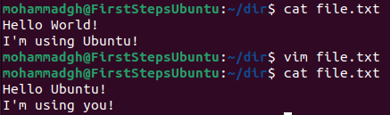
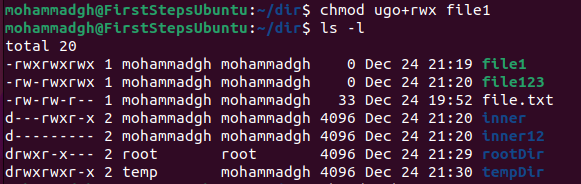

1) Ubuntu Installation
	- install a virtual machine service, we will install Oracle VM VirtualBox
		(you can use VMware workstation player)
		- To install Oracle VM VirtualBox we need to go the their website: https://www.virtualbox.org/wiki/Downloads
		- Choose which OS do you have then install the corresponding version.
		* if you face "Missing Dependencies Python Core / win32api" message.

	- install Ubuntu, go to their website: https://ubuntu.com/download/desktop,
		and choose which version you like, it preferred to be the latest LTS version, I'm installing 22.04.3 LTS version.
	- Now we need to make our new virtual machine:
		- Open Oracle VM VirtualBox, Click on "New" to create a new virtual machine.
		- You need to add the "name" of the virtual machine, "machine folder"
			(where the virtual machine will be stored in your computer) and the path of the "ISO Image of Ubuntu" that you have downloaded earlier, then click on "Next".
		- Now you need to choose your username and password in the virtual machine,
			if you keep the default username and password you will not get the admin privileges, the default username is "vboxuser" and the default password is "changeme", then click on "Next".
		- Now you need to choose how much memory and CPUs you need to configure for
			the virtual machine, I choose 8GB memory and 4 CPUs, then click on "Next".
		- Finally, you need to choose how much space you want, the recommended
			minimum space is 25GB so I chose 25GB, then click "Next".
		- Now you will see a summary of your machine settings, click "Finish".
	- at this time a window will appear, don't interact with it until you get the
		username and password window, meanwhile the Ubuntu is installing on the virtual machine, be patient.

2) Terminal Basics
	Executing commands in Terminal:
	- ls:
 -  
 	- cd:
  - 
	- pwd:
  - 
	- mkdir:
  - 
	- touch:
  - 
	- clear:
  - 
	- cp:
  - 
	- df:
  - 
	- mv:
  - 
	- ps:
  - 
	- rm:
  - 
	- rmdir:
  - 
	- sudo apt:
  - 
	- unzip:
  - 
	- zip:
  - 

3) File Manipulation
	- Create, move, copy and delete files and directories:
	- 
	- cp command used when we want to copy some file/directory from one place to another, the usage: cp <source file/directory> <destination file/directory>
	when copying directory, we need to add the option -r to include all its content recursively.
	- mv command used when we want to move some file/directory from one place to another, the usage: mv <source file/directory> <destination directory>
	- rm command used when we want to remove some file(s)/directory(s), the usage:
	rm <file/directory>...
	when deleting a directory we need to add the option -r to remove all its content recursively.

4) Working with Text Files
	- if we have some text file and we want to view its content we can use cat command on it, like this (the file is empty):
	- 
	- if we want to change its content we can use vim command to view, change, insert content, vim command not installed in default state of Ubuntu, you can install it by executing the following command "sudo apt intsall vim", I have attached a screenshot of installing vim above, in sudo apt section, when we execute vim command on a text file a window appears, if we want to insert some text we hit "i" button then insert whatever we want, like this:
	- 
	- when you finish insert text, hit ESC button to exit insert mode, then type ":w" and press Enter to save, ":q" and press Enter to exit vim without saving, ":wq" and press Enter to save and exit vim.
	- this is the new content after adding text to empty text file.
	- 
	- if you want to append text at the end of the current line, press "A" in normal mode to start appending text at the end of the current line, press "I" in normal mode to insert text at the beginning of the current line, "u" in normal mode to undo changes, "Ctrl+r" in normal mode to redo changes, ":w newfilename.txt" to save the file with different name, ":w!" to force save the current file if it is read-only.
	- this is the same file after appending some text to it:
	- 
	- you can replace any text in text file in the same way as inserting, like this:
	- 
	- or you can replace a pattern using regular expressions by typing
	":s /<text to replace>/<text to be replaced>" then press Enter, save and exit using ":wq", like this:
	- 
	- we got this result:
	- 
	- another way to replace, append text on text file is by using "nano" command, a window appears and you can navigate in the file and change whatever you want, then save using "Ctrl+O" and exit using "Ctrl+C", like this:
	- 

5) User Accounts
	- in order to add new user account we need to use "useradd" command with admin privileges like this:
	- 
	- Consider we want to add a password for this user, we use "passwd" command with admin privileges like this:
	- 
	- now we want to switch between users using "su" command like this:
	- 
	- we can switch between users temporarily by using the command "sudo su <username>" like this, in this way we don't need the user's password:
	- 

6) File Permissions
	- we have some files and directories with permissions, if the left most character is "d" this is a directory if it is "-" it is a file:
	- 
	- In order to change permissions for a file or directory you have to be its owner or any user that has admin privileges, we have 3 permissions "r-read, w-write, x-execute" and 3 owners "u-user, g-group, o-other", using the command "chmod" we can change the permissions, now we will see some examples of the usage of "chmod" command:
		- Consider we want to remove all three permissions from user on directory "inner", we execute this command:
		- 
		- Consider we want to add execute permission for user on file "file1", we execute this command:
		- 
		- Consider we want to remove all three permissions from group on file "file123", we execute this command:
		- 
		- Consider we want to add all three permissions for group on file "file123", we execute this command:
		- 
		- Consider we want to add all three permissions for other on file "file123", we execute this command:
		- 
		- Consider we want to remove all three permissions from user, group and other on directory "inner12", we execute this command:
		- 
		- Consider we want to add all three permissions for user, group and other on file "file1", we execute this command:
		- 
		- Consider we want to remove all three permissions from other on directory "rootDir" or "tempDir", but their owners are not the current user so we need admin authority to change permissions for these directories, we execute this command:
		- 

7) Process Monitoring
	- ps command:
	- 
	- we use "top" command to monitor system processes.
	- 
	- we can see that process 1749 (its ID) has the most resource intensive on the system, so we want to terminate it by using "kill command".
	- I tried to terminate it, but it seemed that it is so important and my linux has terminated 😅 (Don't Do This!).
	- now we will show "htop" command:
	- 
	- Note that it will not be installed in default on Ubuntu, Consider installing it with "sudo apt install htop" before using it.

8) Background and Foreground Processes
